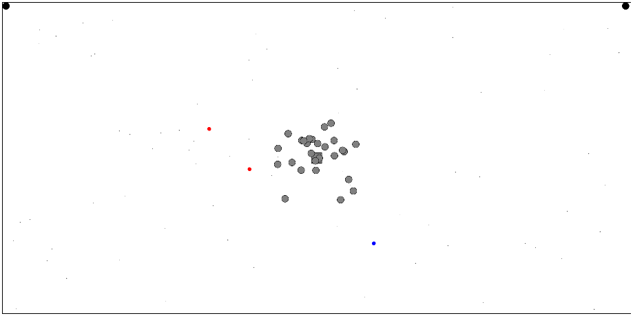

# Agario Clone
One of my very first programs. Made in 2016-2017.

## Overview
[Agar.io](https://www.Agar.io) like game. Collect pellets to gain size. Once you are bigger than the other player, you can swallow them whole.

Originally I would check if two circles were colliding by using rectangles since that was all I knew how to do. However, I have learned how to check if two circles were colliding by using the following inequality:

$\sqrt{\Delta x^2 + \Delta y^2} \leq r_1 + r_2$

Where $r_1$ and $r_2$ are the radii of the circles and $\Delta x = x_2 - x_1$. The left part of the inequality is the distance between two circles, so essentially it is just checking if the distance is less than their radius combined.

The other mistake I made was rather than redrawing the entire scene each frame, instead I thought I was smart by only redrawing spots where a circle moved since clearing the whole screen would be way too inefficient. I would clear a square around the circle and then redraw the circle at its new location. The problem with this is that if the circles were near eachother, they would eat chunks out of eachother leading to the circle randomly turning into a pacman.

## Usage
Run `Index.html` in any web browser.

Use WASD keys to control player 1

Use arrow keys to control player 2
